## Architecture overview

This agent uses a LangGraph pipeline to transform a natural‑language business question into a validated BigQuery query and a concise insight report. The flow is: plan -> synthesize SQL -> validate -> execute -> analyze -> report, with strict SQL safety policies and BigQuery cost guards.

Key components:
- CLI (Click + Rich) for interaction and verbose tracing
- LangGraph nodes for each step with clear transitions
- Google BigQuery as the data source (public dataset thelook_ecommerce)
- Gemini (google-generativeai) as the LLM backend (optional Bedrock fallback)

### Component diagram

### Data flow diagram

```mermaid
sequenceDiagram
  participant U as "👤 USER"
  participant C as "� CLI"
  participant A as "🤖 AGENT"
  participant M as "💾 MEMORY"
  participant L as "✨ GEMINI"
  participant BQ as "🗄️ BIGQUERY"
  participant PD as "📊 PANDAS"

  Note over U,PD: Business Analysis Flow

  U->>+C: Business Question
  C->>+A: Process Question
  
  Note over A,M: Load Context
  A->>M: Get Chat History
  M-->>A: Previous Context

  Note over A,L: Planning Phase
  A->>+L: Generate Plan (schema-aware)
  L-->>-A: JSON Plan
  
  Note over A,BQ: Schema Discovery
  A->>+BQ: Fetch Table Schemas
  BQ-->>-A: Column Metadata

  Note over A,L: SQL Generation
  A->>+L: Synthesize SQL Query
  L-->>-A: BigQuery SQL
  
  Note over A: Security Validation
  A->>A: Validate SQL (SELECT-only, whitelist)

  alt SQL Valid
    Note over A,BQ: Data Execution
    A->>+BQ: Execute Query (limits applied)
    BQ-->>-A: Result Dataset
    
    Note over A,PD: Data Analysis
    A->>+PD: Analyze DataFrame
    PD-->>-A: Statistical Summary
    
    Note over A,L: Report Generation
    A->>+L: Generate Business Insight
    L-->>-A: Executive Report
    
    Note over A,M: Store Session
    A->>M: Save Interaction
  else SQL Invalid
    Note over A: Error Handling
    A->>A: Fallback Strategy
  end

  A-->>-C: Final Report
  C-->>-U: Business Insight

  Note over U,PD: Session Complete
```

Notes:
- SQL safety: only SELECT; only tables orders, order_items, products, users; enforced LIMIT on non-aggregates; maximum_bytes_billed.
- Resilience: optional LLM fallback path; use_query_cache enabled to reduce cost/latency.